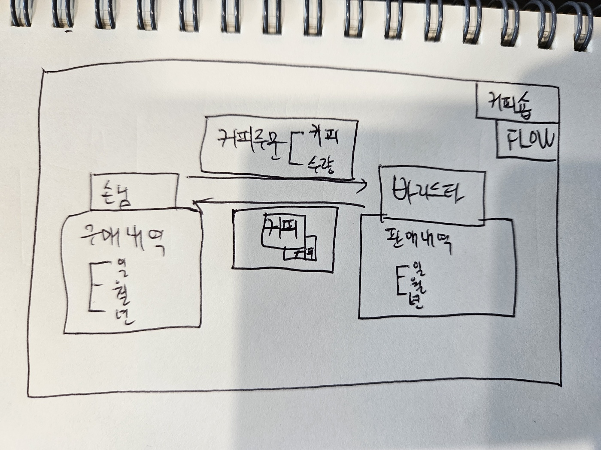

# 객.사.오를 읽고 구현해보는 커피숍
1. POJO 로 먼저 구현해보기
2. REST API 방식으로 구현해보기

## 구조

  

## 도메인 요구사항

#### 손님 	
- 메뉴를 확인할 수 있다.
- 구매 내역을 일 / 월 / 년 별로 확인할 수 있다.
  - 언제, 어떤 바리스타, 어떤 커피, 수량, 주문 별 금액, 총계 
    - 일 : 시간, 커피/수량, 주문 총계(가격)
    - 월 : 몇월 몇일, 커피/수량, 일별 주문 합계(가격), 월 총계(가격)
    - 년 : 몇월 커피/수량, 월별 주문합계(가격) / 년 총계(가격)
- 커피를 주문할 수 있다.
- 바리스타를 지정할 수 있다.(바리스타 이름)
- 어떤 커피를 몇 잔 주문할지 지정할 수 있다.

#### 바리스타
- 판매 내역을 일 / 월 / 년 별로 확인할 수 있다.
   - 언제 어떤 커피, 수량, 총 매출
     - 일 : 시간, 커피/ 수량, 매출 총계(가격)
     - 월 : 일별, 커피/수량 일별 매출 합계(가격), 월 총계(가격)
     - 년 : 월별 커피/수량, 월별 매출 합계(가격), 년 총계(가격)
- 커피를 제조할 수 있다.

# 책임(객체)

#### 손님
1. 등록(생성)될 책임
2. 회원 정보 변경
3. 주문 내역 확인
4. 커피 주문 책임
   4-1. 확장 : 포장/주문 구분
5. 메뉴를 확인할 책임

#### 구매 내역 리스트
1. 구매 내역들을 담을 책임
2. 손님의 구매내역리스트 / 총계를 알려줄 책임

#### 구매 내역
1. 일이라면 시간별로 커피/수량, 합계를 알려줄 책임
2. 월이라면 일별로 커피/수량, 합계를 알려줄 책임
3. 년이라면 월별로 커피/수량, 합계를 알려줄 책임

#### 판매 내역 리스트
1. 판매 내역들을 담을 책임
2. 바리스타의 판매내역리스트 / 총계를 알려줄 책임

#### 판매 내역
1. 일이라면 시간별로 커피/수량, 합계를 알려줄 책임
2. 월이라면 일별로 커피/수량, 합계를 알려줄 책임
3. 년이라면 월별로 커피/수량, 합계를 알려줄 책임

#### 바리스타
1. 바리스타로 생성될 책임
2. 판매 내역을 일 / 월 / 년 별로 확인할 책임
   - 언제 어떤 커피, 수량, 총 매출
     - 일 : 시간, 커피/ 수량, 매출 총계(가격)를 확인할 책임
     - 월 : 일별, 커피/수량 일별 매출 합계(가격), 월 총계(가격)를 확인할 책임
     - 년 : 월별 커피/수량, 월별 매출 합계(가격), 년 총계(가격)를 확인할 책임
3. 커피를 제조할 책임.
   - 한 잔
   - 여러 잔

#### 커피
1. 생산될 책임

#### 커피 주문
1. 고객이 주문할 커피와 수량 데이터를 가지고 있을 책임
